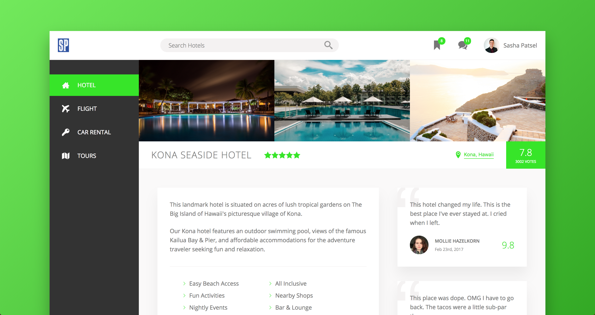
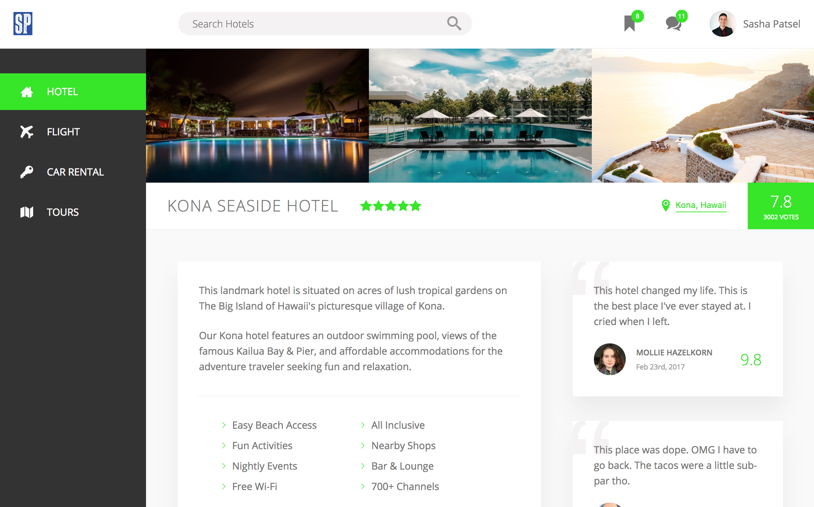
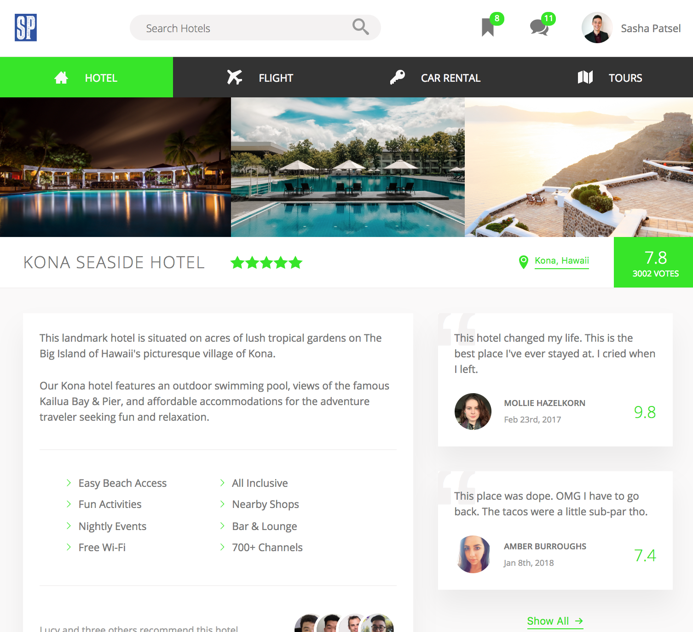
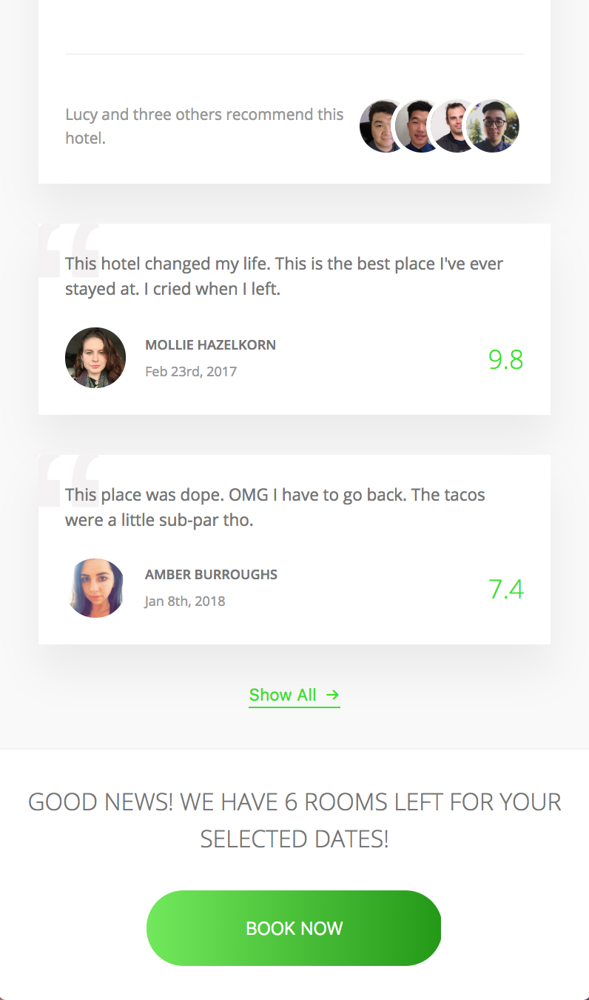

[<h1 align="center"> Book.me </h1>](https://sashapatsel.github.io/book.me/)



[Book.me](https://sashapatsel.github.io/book.me/) is a template for a hotel booking site, showcasing some of the newest and coolest features in CSS!


## Getting Started

These instructions will get you a copy of the project up and running on your local machine for development and testing purposes. See deployment for notes on how to deploy the project on a live system.

### Prerequisites

A modern text editor and browser. 


## Making the App

### Features
Before talking about features individually, it should first be noted that this page makes HEAVY use of flexbox. Flexbox is an excellent short-hand way to position elements where we want them to be within their parent containers. So rather than designated specifically where each element should go, flexbox automatically positions each element in relation to its siblings. 

#### The Side Nav
The side nav has a need animation effect when a user hovers over it. A green color appears from the left side of the selected tap, and then shoots quickly to the right. You can see [here](https://sashapatsel.github.io/book.me/). Here's a look under the hood:

```css

  &__item::before {
    content: "";
    position: absolute;
    top: 0;
    left: 0;
    height: 100%;
    width: 3px;
    background-color: var(--color-primary);
    transform: scaleY(0);
    transition: transform .2s,
                width .4s cubic-bezier(1,0,0,1) .2s,
                background-color .1s;
  }

  &__item:hover::before,
  &__item--active::before {
    transform: scaleY(1);
    width: 100%;
  }

```
The key here is to make the green part a before pseudo element. When we hover over a tab, the cubic bezier function makes it so that the animation starts someone slowly, and then speeds up rapidly at the end. 

#### The Book Now Button

```html
<button class="btn">
    <span class="btn__visible">Book Now</span>
    <span class="btn__hidden">Only 6 rooms left</span>
</button>
```

```css

  &__visible {
    padding: 2rem 7.5rem;
  }

  &__hidden {
    position: absolute;
    left: 0;
    // Moves up the size of the element
    top: -100%;
    padding: 2rem 0;
  }

  &:hover {
    cursor: pointer;
    background: linear-gradient(to left, var(--color-primary-light), var(--color-primary-dark));
  }

  &:hover  &__visible {
    transform: translateY(100%);
  }
  
  &:hover &__hidden {
    top: 0;
  }

```
As you can see above, the button actually consists of two separate span elements. Each is viewable only by itself. By default, we see only the top span with the class `visible`. When we hover, we use the translateY function to move the span down and out of sight. At the same time, the lower span assumes the position of the span that we just dismissed. 

### Responsiveness
[Book.me](https://sashapatsel.github.io/book.me/) is fully responsive. In other words, the design of this app will adapt to whichever device or screen size you are viewing it on.

Take a look below to see how the design adapts to screen size:

#### Medium screens
On medium screens, there is no longer a neewd for all the extra background. The only changes here are simply removing that background, and slightly reducing the size of certain elements. 


#### Small screens
As the screen becomes even smaller, real estate on the page becomes more valuable. Therefore, both the top and side navs move to the top of the screen, giving more breathing room to the main content.


#### Mobile
On mobile, a good rule of thumb is to make each element featured alone on the page, one at a time. As you can see below, the review samples now take up almost all the width of the screen, so that the user does not need to squint top see what was written.



## Deployment

This site is deployed with github pages. You can view it [here](https://sashapatsel.github.io/book.me/).

If you are trying to replicate and deploy this porject on your own, please refer to the package.json to see how the build was run (the build compiles the sass code to css so that it can be read by browsers). 

## Built With

* HTML
* Sass

## Authors

* **Sasha Patsel** - *Initial work* - [Github](https://github.com/SashaPatsel/)

## License

This project is licensed under the MIT License - see the [LICENSE.md](LICENSE.md) file for details

## Acknowledgments

* [Jonas Schmedtmann](https://github.com/jonasschmedtmann) - Thanks for your fantastic advanced CSS course!
